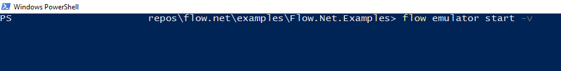

# Emulator Examples

## Getting started

1. Follow [these steps](https://docs.onflow.org/flow-cli/install/) to install the Flow CLI.
2. Clone the [project](https://github.com/tyronbrand/flow.net).
3. Open terminal and navigate to the folder containing the examples project eg. (\flow.net\examples\Flow.Net.Examples).
    
4. Open Solution and run Flow.Net.Examples.